# 🎤 AI Interview Assistant

<div align="center">


**Your Personal AI-Powered Interview Coach**

Master your interview skills with real-time AI feedback and voice interaction

[Features](#-features) • [Installation](#-installation) • [Usage](#-usage) • [Demo](#-how-it-works) • [Contributing](#-contributing)

</div>

<div align="center">
  
  <p><em>AI Interview Assistant - Modern Interface with Real-time Voice Interaction</em></p>
</div>

---

## 🌟 Overview

Transform your interview preparation with an intelligent assistant that listens, understands, and responds like a professional interviewer. Built with Google's cutting-edge Gemini AI and real-time speech recognition, this tool helps you practice confidently and improve naturally.

### ✨ What Makes It Special?

- **🎯 Smart Question Detection** - Automatically identifies interview questions and ignores background noise
- **🤖 AI-Powered Responses** - Leverages Google Gemini for natural, professional answers
- **🗣️ Voice Interaction** - Speaks back to you with browser-based text-to-speech
- **🎨 Modern Interface** - Clean, responsive design that works on any device
- **⚡ Quick Responses** - Optimized cooldown for seamless practice sessions
- **🔒 Secure API Management** - Your API key is stored locally and never shared

---

## 🚀 Features

| Feature | Description |
|---------|-------------|
| **Real-Time Speech Recognition** | Captures your spoken questions instantly using advanced voice recognition |
| **Intelligent AI Responses** | Get professional, humanized answers powered by Google Gemini |
| **Interactive Voice Feedback** | Hear responses read aloud with individual mute controls |
| **User-Friendly Interface** | Built with Eel for a seamless Python-JavaScript experience |
| **Persistent Settings** | Your API key is saved securely for future sessions |
| **Smart Filtering** | Ignores non-questions to reduce false positives |
| **Responsive Design** | Works perfectly on desktop, tablet, and mobile |

---

## 📋 Prerequisites

Before you begin, ensure you have:

- ✅ **Python 3.7+** installed on your system
- ✅ A **Google Gemini API key** ([Get yours here](https://aistudio.google.com/))
- ✅ **Microphone access** enabled in your browser
- ✅ A modern web browser (Chrome, Firefox, or Edge recommended)

---

## 💻 Installation

### Quick Start

```bash
# Clone the repository
git clone https://github.com/Chaitanya0705/ai-interview-assistant.git

# Navigate to the project directory
cd ai-interview-assistant

# Install dependencies
pip install -r requirements.txt
```

### Using Virtual Environment (Recommended)

```bash
# Create virtual environment
python -m venv venv

# Activate virtual environment
# On Windows:
venv\Scripts\activate
# On macOS/Linux:
source venv/bin/activate

# Install required packages
pip install eel SpeechRecognition google-generativeai
```

---

## 🎯 Usage

### Getting Started

1. **Launch the application**
   ```bash
   python inter_ass.py
   ```

2. **Access the interface**
   - The app opens automatically at `http://localhost:8080`
   - If not, manually navigate to the URL in your browser

3. **Configure your API key**
   - Enter your Google Gemini API key in the input field
   - Click "Save API Key" - it's stored securely in `config.json`

4. **Start practicing**
   - Click "Start Listening" to activate the microphone
   - Ask your interview question clearly
   - Watch as AI generates and speaks the response

5. **Control your experience**
   - Use the "Mute" button to toggle audio responses
   - Click "Stop Listening" when finished
   - Use "Clear Text" to reset and start fresh

### 🎬 How It Works

```mermaid
graph LR
    A[🎤 Speak Question] --> B[🔊 Speech Recognition]
    B --> C[🤖 Gemini AI Processing]
    C --> D[💬 Text Response]
    D --> E[🗣️ Text-to-Speech]
    E --> F[👂 Audio Feedback]
```



---

## ⚙️ Configuration

| Setting | Location | Description |
|---------|----------|-------------|
| **API Key** | UI Input → `config.json` | Stored locally, never committed to Git |
| **Server Port** | `inter_ass.py` | Default: 8080 (customizable) |
| **Response Style** | `inter_ass.py` | Modify AI prompt for different tones |
| **Speech Settings** | Browser | Uses native speech synthesis |

---

## 🔧 Troubleshooting

<details>
<summary><b>🎤 Microphone Not Working</b></summary>

- Ensure browser permissions are granted
- Check system microphone settings
- Try Chrome or Firefox for best compatibility
- Test microphone in browser settings
</details>

<details>
<summary><b>🔑 API Key Errors</b></summary>

- Verify your API key is valid at [Google AI Studio](https://aistudio.google.com/)
- Check if you have remaining quota
- Ensure stable internet connection
- Try regenerating your API key
</details>

<details>
<summary><b>🚫 No AI Responses</b></summary>

- Speak clearly and end with a question mark
- Ensure questions start with words like "what," "how," "why"
- Check console logs (F12) for errors
- Verify API key is properly saved
</details>

<details>
<summary><b>🔌 Port Already in Use</b></summary>

- Change port in `inter_ass.py` at `eel.start()` line
- Try ports 8081, 8082, or any available port
- Close other applications using port 8080
</details>

<details>
<summary><b>🐌 Slow Performance</b></summary>

- Check your internet connection speed
- Ensure API server is not experiencing downtime
- Close unnecessary browser tabs
- Try during off-peak hours
</details>

---

## 🤝 Contributing

Contributions are what make the open-source community amazing! Any contributions you make are **greatly appreciated**.

### How to Contribute

1. **Fork** the repository
2. **Create** your feature branch
   ```bash
   git checkout -b feature/AmazingFeature
   ```
3. **Commit** your changes
   ```bash
   git commit -m 'Add some AmazingFeature'
   ```
4. **Push** to the branch
   ```bash
   git push origin feature/AmazingFeature
   ```
5. **Open** a Pull Request

### Ideas for Contribution

- 🎨 Improve UI/UX design
- 🌐 Add multi-language support
- 📊 Implement performance analytics
- 🎓 Add interview question categories
- 🔧 Optimize response generation
- 📱 Enhance mobile experience

---

## 📄 License

This project is licensed under the **MIT License** - see the [LICENSE](LICENSE) file for details.

```
MIT License - Feel free to use, modify, and distribute
```

---

## 👨‍💻 Author

<div align="center">

**Chaitanya A. Patil**

[](https://github.com/Chaitanya0705)
[](https://linkedin.com/in/yourprofile)

*Creator & Maintainer*

💡 Questions or suggestions? Feel free to reach out!

</div>

---

## 🙏 Acknowledgements

This project wouldn't be possible without these amazing technologies:

- 🧠 [Google Gemini AI](https://ai.google.dev/) - Powering intelligent responses
- 🎨 [Eel](https://github.com/ChrisKnott/Eel) - Seamless Python-JavaScript integration
- 🎤 [SpeechRecognition](https://pypi.org/project/SpeechRecognition/) - Voice capture and processing
- 🗣️ [Web Speech API](https://developer.mozilla.org/en-US/docs/Web/API/Web_Speech_API) - Browser-based text-to-speech

Special thanks to the open-source community for continuous inspiration!

---

## 📊 Project Stats

<div align="center">


</div>

---

<div align="center">

**Built with ❤️ to make interview preparation easier**

⭐ **Star this repo** if you find it helpful!

*Practice makes perfect - Start your journey today!*

</div>
